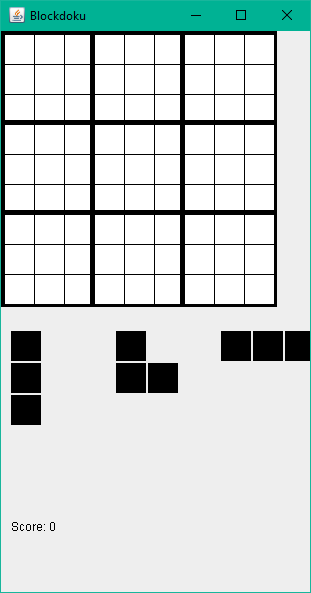

<a id="readme-top"></a>

[![Portfolio][portfolio-shield]][portfolio-url]

<br />
<div align="center">
  <h3 align="center">Blockdoku</h3>
  <p align="center">
    Where Sudoku meets a Block Puzzle
  </p>
</div>

<!-- TABLE OF CONTENTS -->
<details>
  <summary>Table of Contents</summary>
  <ol>
    <li>
      <a href="#about-the-project">About The Project</a>
      <ul>
        <li><a href="#built-with">Built With</a></li>
      </ul>
    </li>
    <li>
      <a href="#getting-started">Getting Started</a>
      <ul>
        <li><a href="#prerequisites">Prerequisites</a></li>
        <li><a href="#installation">Installation</a></li>
      </ul>
    </li>
    <li><a href="#license">License</a></li>
    <li><a href="#contact">Contact</a></li>
    <li><a href="#acknowledgments">Acknowledgments</a></li>
  </ol>
</details>

<!-- ABOUT THE PROJECT -->

## About The Project



### Purpose of project

The project serves as a game that combines sudoku with blocks hence the name blockdoku. This is a university project used to display concepts I had learned in an object oriented programming module.

### How to play

Players have randomly generated tiles that they must place on the 9x9 grid. Filling the 3x3 subgrid, or a full row or full column earns points. The users aim is to score as many points as possible until there are no available places on the grid where the tile can be placed.

<p align="right">(<a href="#readme-top">back to top</a>)</p>

### Built With

- [![Java][Java]][Java-url]

<p align="right">(<a href="#readme-top">back to top</a>)</p>

<!-- GETTING STARTED -->

## Getting Started

This section outlines how one would go about installing and running the project locally.

### Prerequisites

Ensure Java is installed on you machine

- Java Development Kit (JDK)
  The latest version of JDK can be installed [here](https://www.oracle.com/java/technologies/downloads/)
  Verify the installation:
  ```sh
  java -version
  ```

### Installation

1. Clone the repo
   ```sh
   git clone https://github.com/Habib-aw/Blockdoku.git
   ```
2. Navigate to the project directory
   ```sh
   cd Blockdoku
   ```
3. Run the Application
   ```js
   java BlockdokuController.java
   ```

<p align="right">(<a href="#readme-top">back to top</a>)</p>

<!-- LICENSE -->

## License

Distributed under the MIT License. See `LICENSE.txt` for more information.

<p align="right">(<a href="#readme-top">back to top</a>)</p>

<!-- CONTACT -->

## Contact

Habib Abdul Wahid - [Habib.awahid01@gmail.com](mailto:habib.awahid01@gmail.com)

<p align="right">(<a href="#readme-top">back to top</a>)</p>

<!-- ACKNOWLEDGMENTS -->

## Acknowledgments

- [Template for README file](https://github.com/othneildrew/Best-README-Template/blob/main/README.md)
- [Choose an Open Source License](https://choosealicense.com)

<p align="right">(<a href="#readme-top">back to top</a>)</p>

<!-- MARKDOWN LINKS & IMAGES -->
<!-- https://www.markdownguide.org/basic-syntax/#reference-style-links -->

[portfolio-shield]: https://img.shields.io/badge/Portfolio-000?style=for-the-badge&logo=web&logoColor=white
[portfolio-url]: https://habibabdulwahid.com/
[product-screenshot]: images/screenshot.png
[Java]: https://img.shields.io/badge/Java-007396?style=for-the-badge&logo=java&logoColor=white
[Java-url]: https://www.java.com/
